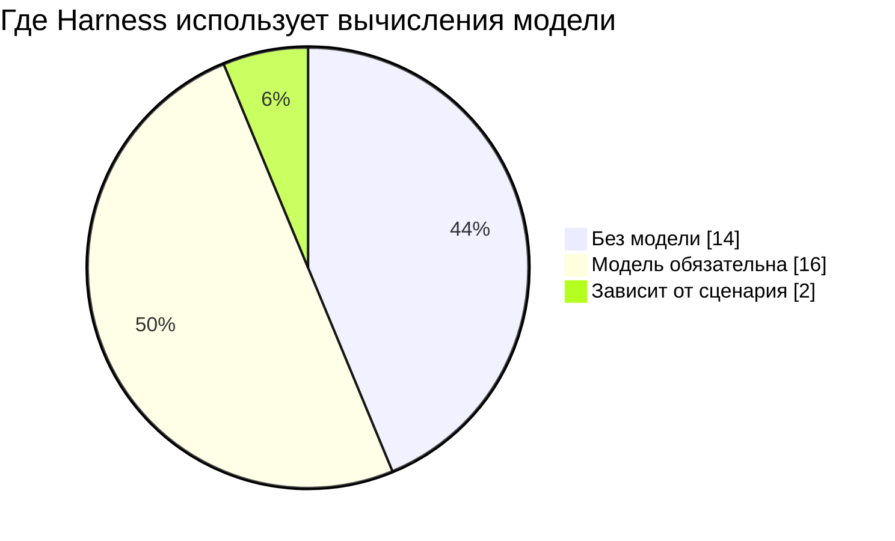
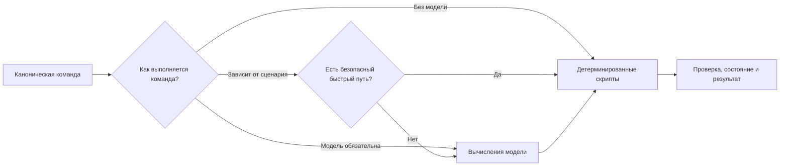

# Границы вычислений модели

Harness использует модель только там, где требуется смысловое решение.
Проверяемая, вычислимая и механическая работа по возможности выполняется
детерминированными скриптами.

Источник истины — `.harness/command-transitions.json`. Таблица и числовая
сводка ниже генерируются автоматически. Ручное редактирование блока между
служебными маркерами запрещено.

Режим относится к собственной обработке канонической команды. Если команда
запускает дочерние команды, их вычисления учитываются отдельно. Например,
обычный STEP RUN управляется скриптом, но дочерние PLAN, IMPLEMENT, REVIEW
и FIX по-прежнему выполняют необходимую смысловую работу модели.

Машиночитаемая проекция для внешних потребителей:

```text
.harness/reasoning-boundaries.json
```

<!-- REASONING-BOUNDARIES:START -->
## Сводка

| Режим | Количество команд |
|---|---:|
| Без вычислений модели | 14 |
| Вычисления модели обязательны | 16 |
| Зависит от сценария | 2 |
| **Всего** | **32** |



## Принцип выполнения



## Команды

| Команда | Режим | Что делает модель | Что делают скрипты | Когда модель не нужна |
|---|---|---|---|---|
| `PROJECT INIT` | Модель обязательна | Преобразование исходного описания проекта в согласованные требования и план работ<br>Смысловая проверка согласованности начальных артефактов | Проверка схемы и целостности<br>Запись канонических артефактов и проекций | — |
| `PROJECT STATUS` | Без модели | — | Пересборка проекций<br>Проверка целостности<br>Формирование сводки состояния<br>Расчёт следующей доступной работы | — |
| `PROJECT RECONCILE` | Модель обязательна | Сопоставление фактической реализации с требованиями, архитектурой и планом<br>Классификация расхождений и подготовка корректирующих действий | Миграция поддерживаемых схем<br>Пересборка проекций<br>Проверка ссылок и целостности | — |
| `PROJECT QUICK FIX:` | Модель обязательна | Определение, что изменение действительно мало и не меняет контракт<br>Внесение самой правки | Проверка ограничений<br>Проверка результата | — |
| `STEP ADD:` | Модель обязательна | Определение границ задачи, зависимостей и связей с требованиями и архитектурными решениями | Выдача идентификатора<br>Запись и проверка структуры STEP | — |
| `STEP LIST` | Без модели | — | Чтение и упорядочивание канонических STEP | — |
| `STEP SHOW STEP-NNN` | Без модели | — | Чтение STEP и связанных проверяемых данных | — |
| `STEP NEXT` | Без модели | — | Анализ состояния, приоритетов, зависимостей и влияния на последующие задачи<br>Выбор следующей канонической команды | — |
| `STEP PLAN STEP-NNN` | Модель обязательна | Подготовка плана реализации<br>Независимая смысловая проверка плана | Сбор точного контекста<br>Расчёт отпечатков<br>Запись и проверка плана | — |
| `STEP IMPLEMENT STEP-NNN` | Модель обязательна | Изменение кода и конфигурации по утверждённому плану | Проверка готовности плана и зависимостей<br>Запуск автоматических проверок<br>Фиксация доказательств выполнения | — |
| `STEP REVIEW STEP-NNN` | Модель обязательна | Поиск смысловых дефектов реализации<br>Проверка соответствия требованиям и критериям приёмки | Выбор обязательных специализированных проверок<br>Фиксация точной ревизии<br>Запись и проверка отчёта<br>Проверка доказательства завершения | — |
| `STEP FIX STEP-NNN` | Модель обязательна | Исправление подтверждённых замечаний | Контроль допустимого перехода<br>Запуск автоматических проверок<br>Обновление доказательств выполнения | — |
| `STEP RUN STEP-NNN` | Зависит от сценария | В обычном цикле модель вызывается внутри дочерних PLAN, IMPLEMENT, REVIEW и FIX<br>Для специальных типов STEP дополнительно используется смысловая оркестрация самого STEP RUN | Оркестрация обычного цикла планирования, реализации, проверки и исправлений<br>Учёт лимита циклов исправления и проверки<br>Возобновление прерванного выполнения | Для обычных задач разработки переходы между PLAN, IMPLEMENT, REVIEW и FIX выполняются без отдельного вызова модели |
| `STEP AUDIT STEP-NNN` | Модель обязательна | Сопоставление STEP, реализации и доказательств<br>Формулировка выводов аудита | Сбор проверяемых фактов<br>Проверка ссылок и состояния артефактов<br>Запись отчёта | — |
| `SKILL FIND:` | Модель обязательна | Оценка пригодности найденных навыков и связанных рисков | Ограничение размера выдачи<br>Фиксация происхождения и результатов поиска | — |
| `SKILL INSTALL:` | Модель обязательна | Проверка содержимого, происхождения и рисков стороннего навыка | Копирование выбранного набора файлов<br>Обновление реестра и маршрутизации<br>Проверка целостности | — |
| `SKILL CREATE:` | Модель обязательна | Проектирование нового навыка под отсутствующий сценарий | Проверка структуры<br>Регистрация и проверка маршрутизации | — |
| `GITHUB GENERATE TEMPLATES` | Модель обязательна | Анализ текущего технологического стека и правил проекта<br>Формирование содержимого шаблонов | Запись шаблонов<br>Проверка структуры файлов | — |
| `RELEASE CHECK` | Модель обязательна | Оценка смысловых рисков выпуска<br>Проверка соответствия фактического состояния заявленной готовности | Сбор проверяемых фактов<br>Запуск обязательных проверок<br>Запись отчёта | — |
| `HARNESS HELP` | Без модели | — | Формирование справки из таблицы канонических команд | — |
| `HARNESS UPDATE CHECK` | Без модели | — | Построение маршрута обновления<br>Проверка версий, владения файлами и возможных конфликтов<br>Предварительная проверка без изменения проекта | — |
| `HARNESS UPDATE APPLY` | Без модели | — | Пошаговое применение обновления<br>Трёхстороннее слияние разрешённых файлов<br>Откат при ошибке<br>Проверка результата и обновление состояния версии | — |
| `HARNESS STATUS` | Без модели | — | Сбор состояния Harness, Git и незавершённых команд | — |
| `HARNESS RESUME` | Без модели | — | Поиск единственного безопасно возобновляемого выполнения<br>Восстановление следующего действия | — |
| `HARNESS DOCTOR` | Без модели | — | Проверка обязательных зависимостей и исправности среды | — |
| `HARNESS CONFIG` | Без модели | — | Сбор фактически применяемой конфигурации и её источников | — |
| `GIT CHECK` | Без модели | — | Проверка ветки, удалённого репозитория, рабочих изменений, политик и целостности Harness | — |
| `GIT COMMIT` | Модель обязательна | Проверка, что изменения образуют одно смысловое изменение<br>Выбор типа и формулировка сообщения коммита | Проверка политики Git<br>Безопасная подготовка файлов<br>Создание коммита<br>Проверка изменения HEAD | — |
| `GIT PUSH` | Зависит от сценария | Проверка смысловой целостности отправляемого изменения при отдельном запуске команды | Проверка состояния Git и политики отправки<br>Отправка без принудительной перезаписи<br>Проверка опубликованного HEAD | Если PUSH следует сразу после доказанного GIT COMMIT в той же цепочке, повторный вызов модели не требуется |
| `GIT PR` | Модель обязательна | Формирование заголовка и описания запроса на слияние | Проверка опубликованной ветки<br>Поиск существующего запроса на слияние<br>Создание или переиспользование запроса<br>Проверка опубликованной ревизии | — |
| `GIT PR FINISH` | Без модели | — | Подтверждение слияния<br>Безопасный возврат на исходную ветку<br>Синхронизация только перемоткой вперёд<br>Удаление проверенной локальной ветки | — |
| `GIT SYNC` | Без модели | — | Обновление сведений об удалённом репозитории<br>Расчёт расхождения<br>Безопасная перемотка вперёд при разрешении | — |

## Условные быстрые пути

Условный быстрый путь разрешён только тогда, когда код явно доказывает
его предпосылки. Одного ответа модели об успехе недостаточно.

### `STEP RUN STEP-NNN`

- Для обычных задач разработки переходы между PLAN, IMPLEMENT, REVIEW и FIX выполняются без отдельного вызова модели.
  Реализация: `.harness/tools/command_dispatch.py::_dispatch_step_run`.

### `GIT PUSH`

- Если PUSH следует сразу после доказанного GIT COMMIT в той же цепочке, повторный вызов модели не требуется.
  Реализация: `.harness/tools/command_dispatch.py::_git_push_after_commit_fast_path`.
<!-- REASONING-BOUNDARIES:END -->
